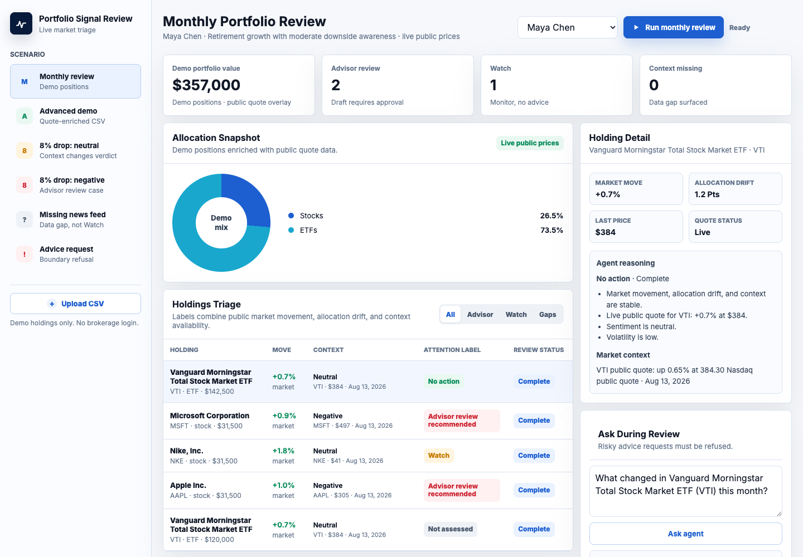
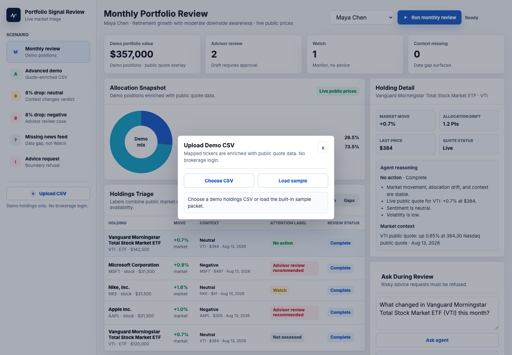
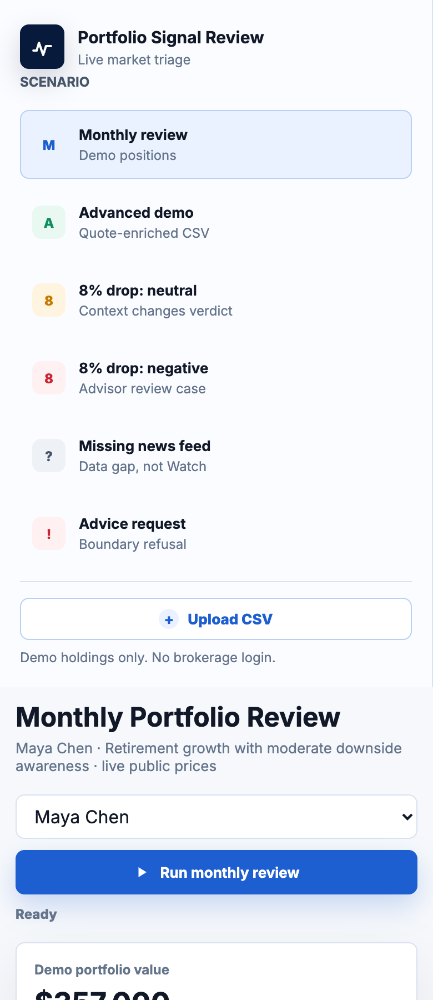

# Portfolio Signal Review

Portfolio Signal Review is a local web prototype for reviewing a demo investment portfolio with public market quote data.

The app does not connect to Vanguard or any brokerage account. It uses demo position values and enriches mapped ticker symbols with public quote data from a small local Node backend.

## Screenshots

Desktop dashboard:



CSV upload flow:



Mobile layout:



## What The Prototype Shows

- Demo portfolio overview with current public quote movement
- Holdings triage table with attention labels
- Holding detail and reasoning panel
- Advisor escalation draft that requires human approval
- CSV upload flow for demo holdings
- Public quote enrichment for mapped tickers
- Refusal behavior for buy, sell, rebalance, timing, increase, decrease, or hold advice requests

## Run Locally

From this project folder:

```bash
npm start
```

Then open the URL printed in the terminal, usually:

```text
http://127.0.0.1:5174/website/
```

If port `5174` is busy, the server automatically tries the next available port and prints the correct URL.

## CSV Upload Sample

Use this sample file to test the Advanced Demo upload flow:

```text
data/portfolio_signal_review/mock_upload_sample.csv
```

In the app:

1. Click `Upload CSV`.
2. Click `Choose CSV`.
3. Select `data/portfolio_signal_review/mock_upload_sample.csv`.
4. The backend enriches mapped tickers with public quote data.

## Market Data

The backend fetches public quote data for mapped tickers and adds fields such as:

- `ticker_symbol`
- `market_company_name`
- `market_price`
- `market_change_pct`
- `market_timestamp`
- `market_data_source`
- `market_data_status`

The demo portfolio values and allocation percentages are not brokerage data.

## Important Boundary

This prototype is not a financial advisor and does not provide investment advice. It should not recommend buying, selling, rebalancing, holding, increasing, decreasing, or timing investments.

It is designed to summarize market signals and prepare questions for human review.

## GitHub Hosting Note

GitHub Pages can host static websites only. This prototype uses a Node backend for `/api/...` routes, so GitHub Pages alone cannot run the live quote version.

Recommended paths:

- Use GitHub as the source repository.
- Deploy the Node app to a service that supports backend code.
- Use GitHub Pages only for a static fallback demo.
